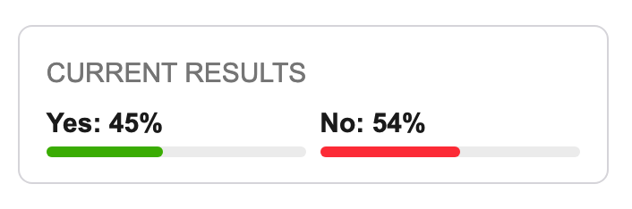

# dcl vote status forum overlay



## Purpose

This is a Chrome (and Edge, Brave) extension that overlays the vote counts of the corresponding DAO Proposal on the Decentraland forum. Seeing the vote counts associated with the discussion provides important context and helps contributors frame their responses, ideas, and critique. 

Navigating to a forum topic generated by the DAO from a proposal will show the current vote distribution.

## Use
Like any plugin, you should carefully audit the permissions granted in the manifest.json and use it only if the permissions fit within your risk profile.

You can download the most recent build in dist.zip from the releases on the right then unzip it and load it unpacked using the instructions below.

To build the plugin yourself, clone this repo into your project directory.

```
git clone https://github.com/twaldorf/dcl-forum-votes-overlay your-directory-name
```

Install dependencies:

```
yarn install # or npm install
```

Run a development server that will watch for file changes and rebuild the scripts, run:

```
yarn start
```

To just build the files without the development server:

```
yarn build
```

Both commands will create a `dist/` directory, it will contain the built files that should be loaded into the browser or packed.

## Load into Chrome

To load the built files into Chrome, open [chrome://extensions/](chrome://extensions/).

Enable "Developer mode" if it's not enabled yet:


Click on "Load unpacked":


Find the `dist/` directory on your system and open it.

The extension should be now at the top of the page:


## Known issues and bugs

See the Issues and contribute new issues if you find them.
